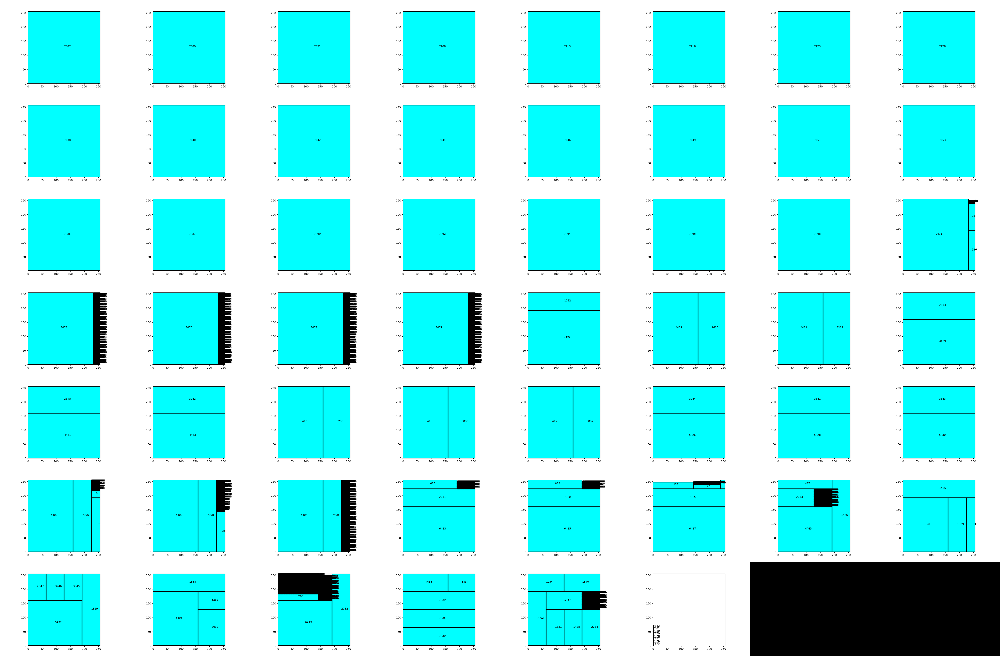
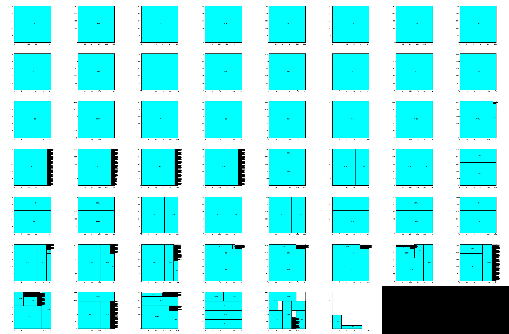

# AI Accelerator Design Garage

Various functions and resources to help in designing accelerators

## Comp Graph

Turns ONNX (or any, just haven't implemented it yet) to nodes that contain numpy arrays. The filesize blows up, but they're easier to work with for turning into test inputs for verilog testbenches.

## Bin Packing

Sample packing of MobileNetv2 with BAF

Sample packing of MobileNetv2 with BAF
