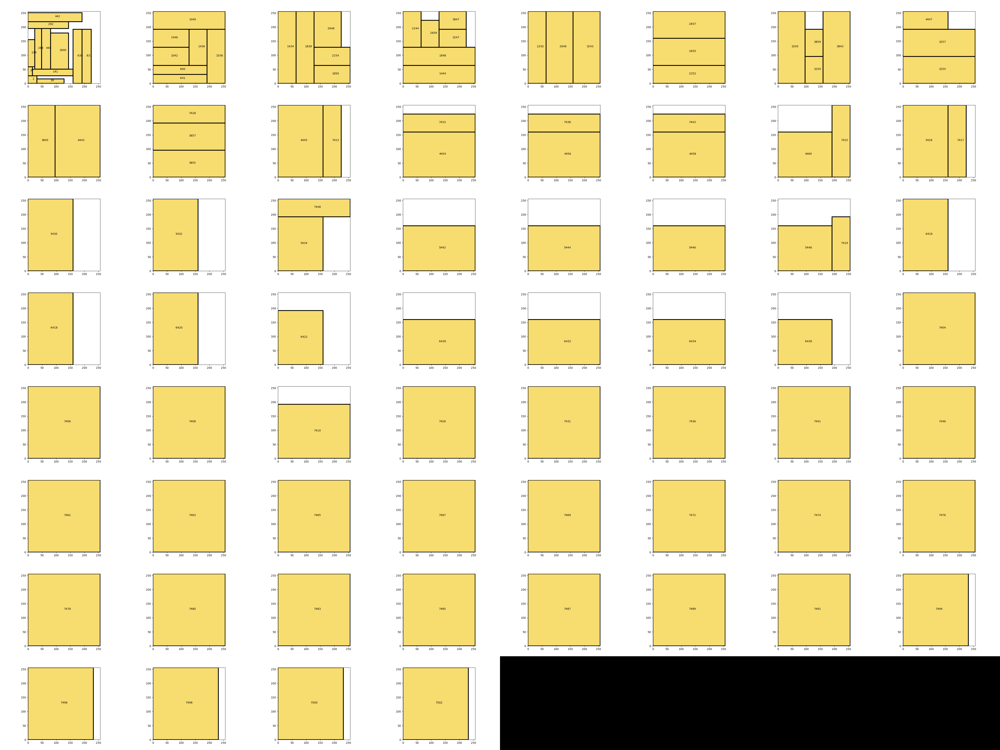

# AI Accelerator Design Garage

Various functions and resources to help in designing accelerators

## How to use

```
git clone https://github.com/Lawrence-lugs/hwacc_design_garage.git
cd hwacc_design_garage
pip install -e .
```

## Quantization: Bundle of tools for quantized linear algebra calculations and testing

```python
import hwacctools.quantization.quant as q

m0, shift = q.convert_scale_to_shift_and_m0(0.019110053777694702)
fp_int = q.convert_to_fixed_point_int(m0,16)
print((m0 * 2**(shift)) - (fp_int * 2**(shift-16))) # == 0
print((m0 * 2**(shift))) # Within 10^-7 of scale
```

## Comp Graph

Turns ONNX to nodes that contain numpy arrays. The filesize blows up, and it becomes much slower, but they're easier to work with for turning into test inputs for verilog testbenches.

```python
from hwacctools.comp_graph import splitter, cnodes, cgraph
import onnx
import numpy as np
from torchvision import transforms
from PIL import Image

modelpath = 'onnx_models/mobilenetv2-12-int8.onnx'
# modelpath = 'onnx_models/mbv2_main.onnx'

nx_model = onnx.load(modelpath)
img = Image.open('images/imagenet_finch.jpeg')
img_tensor = transforms.ToTensor()(img).float()
img_tensor = transforms.CenterCrop(32)(img_tensor)
# tensor_input = img_tensor.unsqueeze()
img_array = np.array(img_tensor)

input_dict = {
    'input':img_array
}

cgraph_UUT = cgraph.Cgraph.from_onnx_model(nx_model)
out = cgraph_UUT.forward(input_dict)
```

## Bin Packing

Utilities for applying rectangular bin packing algorithms on the computational graphs.
(Most of the actual implementation is inside comp_graph/core at the moment)



## Requirements

Two options: `pip install` the requirements or
`conda env create -f env.yml`.

The latter will download everything, but you may only want some subfolders, so I recommend just installing as you go along.